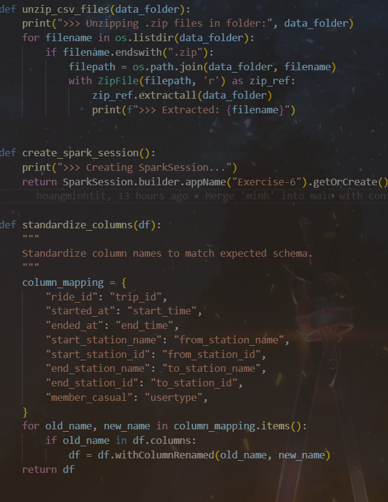
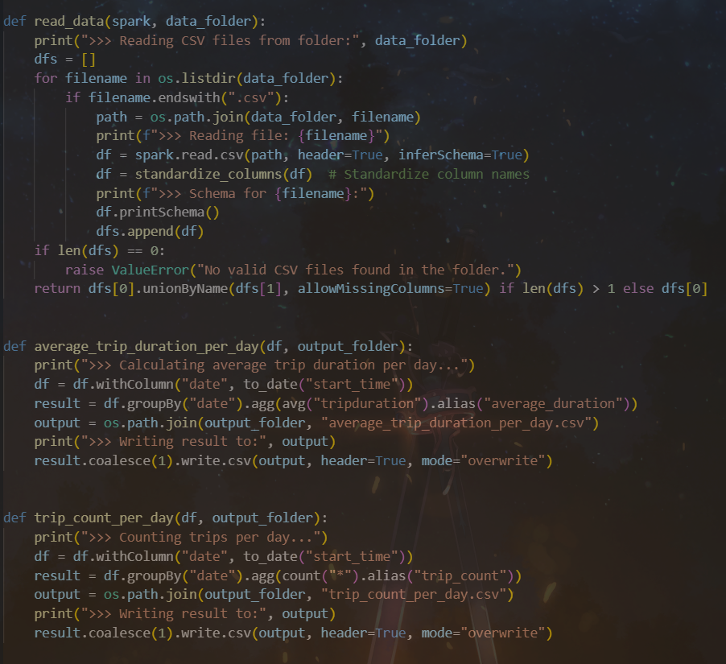
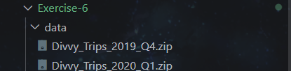
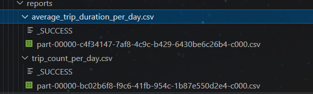

## Exercise 6: Ingestion and Aggregation with PySpark.

Các hàm thực hiện cho bài 6

## Data trước khi được xử lý 

### Tiến hành giải nén, đọc các file data và tiến hành tính toán ghi lại kết quả vào các file CSV ở folder reports

